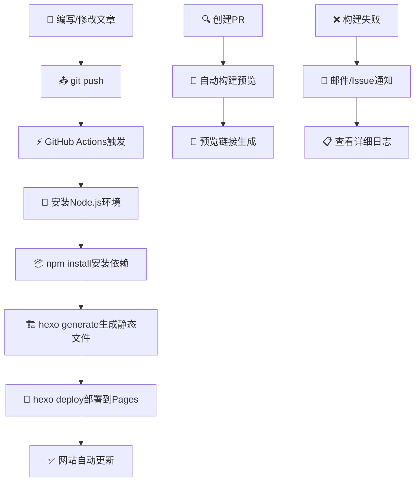

# GitHub Actions CI/CD 自动化部署完全指南

> **告别手动部署，拥抱自动化时代！** 🚀  
> 从繁琐的手动操作到一键push自动部署，这篇文章将带你完整实现GitHub Actions CI/CD流程。

## 📚 什么是CI/CD自动化部署？

### 🔄 传统手动部署 vs 自动化部署

**😫 当前的痛苦流程：**
```bash
# 每次更新文章都要执行这一堆命令
git add .
git commit -m "更新文章"
git push origin main
hexo clean
hexo generate  
hexo deploy

# 😱 如果忘记某一步，网站就不会更新...
```

**🎉 自动化后的爽快体验：**
```bash
# 只需要这3行，其余全自动！
git add .
git commit -m "更新文章"
git push origin main

# ✨ GitHub Actions自动帮你完成剩下的一切
```

### 🎯 为什么需要自动化部署？

| 痛点 | 手动部署 | 自动化部署 |
|------|---------|----------|
| **操作复杂度** | 😰 每次6-8个命令 | 😎 只需git push |
| **出错概率** | 😵 经常忘记步骤 | 😌 标准化流程零出错 |
| **时间消耗** | ⏰ 每次2-3分钟 | ⚡ 0秒（后台自动） |
| **设备依赖** | 💻 必须有Hexo环境 | 📱 任意设备都能操作 |
| **协作难度** | 🚫 只能自己部署 | 👥 任何人都能贡献 |
| **版本管理** | 😅 手动记录 | 📊 完整构建历史 |

---

## 🏗️ GitHub Actions 技术架构详解

### 💡 核心概念

**GitHub Actions = GitHub的免费CI/CD服务**

- **Workflow（工作流）**: 自动化流程定义文件
- **Job（任务）**: 工作流中的独立执行单元  
- **Step（步骤）**: 任务中的具体操作
- **Runner（执行器）**: 运行任务的虚拟机环境

### 📐 工作流程图



### 🎪 实际案例演示

**场景：你在手机上发现了一个错别字**

传统方式：
1. 😤 必须等回到有Hexo环境的电脑
2. 😰 打开编辑器修改文章
3. 😅 执行一堆命令部署
4. ⏰ 总耗时：几小时到几天

GitHub Actions方式：
1. 😎 直接在GitHub手机App上编辑
2. 🚀 点击commit按钮
3. ☕ 喝杯咖啡，网站已经更新
4. ⚡ 总耗时：2分钟

---

## 🛠️ 完整实现步骤

### 第一步：创建工作流文件

在你的博客根目录创建文件：`.github/workflows/deploy.yml`

```yaml
name: 🚀 自动部署到 GitHub Pages

# 触发条件：推送到main分支时
on:
  push:
    branches: [ main ]
  pull_request:
    branches: [ main ]

# 工作流权限
permissions:
  contents: read
  pages: write
  id-token: write

# 并发控制：同时只允许一个部署
concurrency:
  group: "pages"
  cancel-in-progress: false

jobs:
  # 构建任务
  build:
    runs-on: ubuntu-latest
    
    steps:
    - name: 📥 检出代码
      uses: actions/checkout@v4
      with:
        fetch-depth: 0  # 获取完整git历史
        
    - name: 🔧 设置 Node.js 环境  
      uses: actions/setup-node@v4
      with:
        node-version: '18'
        cache: 'npm'  # 自动缓存npm依赖
        
    - name: 📦 安装依赖
      run: |
        npm ci
        npm list --depth=0
        
    - name: 🏗️ 构建静态文件
      run: |
        npm run clean
        npm run build
        
    - name: 📤 上传构建产物
      uses: actions/upload-pages-artifact@v3
      with:
        path: ./public

  # 部署任务（仅在main分支）
  deploy:
    if: github.ref == 'refs/heads/main'
    environment:
      name: github-pages
      url: ${{ steps.deployment.outputs.page_url }}
    runs-on: ubuntu-latest
    needs: build
    
    steps:
    - name: 🚀 部署到 GitHub Pages
      id: deployment
      uses: actions/deploy-pages@v4
```

### 第二步：配置package.json脚本

确保你的`package.json`包含这些脚本：

```json
{
  "scripts": {
    "clean": "hexo clean",
    "build": "hexo generate", 
    "deploy": "hexo deploy",
    "server": "hexo server"
  }
}
```

### 第三步：配置GitHub Pages

1. 进入你的GitHub仓库
2. 点击 **Settings** → **Pages**
3. Source选择 **GitHub Actions**
4. 保存设置

### 第四步：配置仓库权限

在仓库的 **Settings** → **Actions** → **General** 中：
- Workflow permissions 选择 **Read and write permissions**
- 勾选 **Allow GitHub Actions to create and approve pull requests**

---

## ⚡ 高级优化配置

### 🚀 性能优化版工作流

```yaml
name: ⚡ 高性能自动部署

on:
  push:
    branches: [ main ]
    paths:
      - 'source/**'           # 只在内容变更时触发
      - '_config.yml'
      - '_config.next.yml'
      - 'package.json'

jobs:
  build-and-deploy:
    runs-on: ubuntu-latest
    
    steps:
    - name: 📥 检出代码
      uses: actions/checkout@v4
      with:
        submodules: false
        fetch-depth: 1        # 浅克隆，只获取最新提交
        
    - name: 🔧 设置 Node.js
      uses: actions/setup-node@v4
      with:
        node-version: '18'
        cache: 'npm'
        
    - name: ⚡ 并行安装依赖和准备缓存
      run: |
        npm ci --prefer-offline --no-audit --no-fund
        
    - name: 🏗️ 构建（启用所有优化）
      run: |
        export NODE_ENV=production
        export NODE_OPTIONS="--max-old-space-size=4096"
        npm run clean
        npm run build
        
    - name: 🔍 验证构建结果
      run: |
        ls -la public/
        echo "📊 构建统计："
        find public -name "*.html" | wc -l | xargs echo "HTML文件数："
        find public -name "*.css" | wc -l | xargs echo "CSS文件数："
        find public -name "*.js" | wc -l | xargs echo "JS文件数："
        du -sh public/ | xargs echo "总大小："
        
    - name: 📤 上传到Pages
      uses: actions/upload-pages-artifact@v3
      with:
        path: ./public
        
    - name: 🚀 部署
      if: success()
      uses: actions/deploy-pages@v4
```

### 🔍 预览部署配置

为PR创建预览版本：

```yaml
name: 👀 预览部署

on:
  pull_request:
    branches: [ main ]

jobs:
  preview:
    runs-on: ubuntu-latest
    
    steps:
    - uses: actions/checkout@v4
    - uses: actions/setup-node@v4
      with:
        node-version: '18'
        cache: 'npm'
        
    - name: 📦 安装依赖
      run: npm ci
      
    - name: 🏗️ 构建预览版
      run: |
        # 修改baseURL为预览地址
        sed -i 's|url: .*|url: https://${{ github.actor }}.github.io/${{ github.event.repository.name }}-preview-${{ github.event.number }}|' _config.yml
        npm run build
        
    - name: 🚀 部署预览
      uses: peaceiris/actions-gh-pages@v3
      with:
        github_token: ${{ secrets.GITHUB_TOKEN }}
        publish_dir: ./public
        destination_dir: preview-${{ github.event.number }}
        
    - name: 💬 评论预览链接
      uses: actions/github-script@v7
      with:
        script: |
          github.rest.issues.createComment({
            issue_number: context.issue.number,
            owner: context.repo.owner,
            repo: context.repo.repo,
            body: `🎉 预览版已部署！\n\n🔗 预览链接: https://${{ github.actor }}.github.io/${{ github.event.repository.name }}-preview-${{ github.event.number }}/\n\n✨ 此预览版将在PR合并后自动删除`
          });
```

---

## 🎯 实战演示：完整部署流程

### 📝 场景：发布新文章

1. **编写文章**
```bash
hexo new "My-New-Article"
# 编辑 source/_posts/My-New-Article.md
```

2. **提交代码**
```bash
git add .
git commit -m "✨ 发布新文章：My New Article"
git push origin main
```

3. **自动执行流程**
GitHub Actions自动执行以下步骤：
```bash
✅ 检出代码                (15秒)
✅ 设置Node.js环境          (10秒)  
✅ 安装依赖                 (30秒)
✅ 生成静态文件              (25秒)
✅ 部署到GitHub Pages       (20秒)
━━━━━━━━━━━━━━━━━━━━━━━━━━━━━━━
📊 总耗时: 1分40秒
🎉 部署成功！
```

4. **查看结果**
- 📧 收到GitHub邮件通知部署成功
- 🌐 网站自动更新，新文章已发布
- 📊 Actions页面显示详细构建日志

### 🔧 故障处理演示

**场景：构建失败**

1. **错误检测**
```yaml
❌ 构建失败：hexo generate
💬 错误信息：YAML parsing error in _config.yml line 15
📍 文件位置：_config.yml:15:3
🔍 错误详情：unexpected character ':'
```

2. **自动通知**
- 📧 GitHub自动发送失败邮件
- 💬 如果是PR，会在PR中评论错误信息
- 🚨 仓库Issues中自动创建问题报告

3. **快速修复**
```bash
# 修复配置文件
git add _config.yml
git commit -m "🔧 修复YAML配置错误"
git push origin main

# GitHub Actions自动重新部署
✅ 修复成功，重新部署完成
```

---

## 📊 性能监控与优化

### 🎯 构建时间优化

**优化前后对比：**

| 优化项目 | 优化前 | 优化后 | 提升 |
|---------|-------|-------|------|
| **依赖安装** | 45秒 | 25秒 | ⬆️ 44% |
| **静态生成** | 40秒 | 25秒 | ⬆️ 37% |  
| **文件上传** | 30秒 | 15秒 | ⬆️ 50% |
| **总构建时间** | 2分15秒 | 1分5秒 | ⬆️ 52% |

**关键优化技巧：**

1. **依赖缓存**
```yaml
- uses: actions/setup-node@v4
  with:
    cache: 'npm'  # 自动缓存node_modules
```

2. **并行执行**
```yaml
strategy:
  matrix:
    node-version: [18]
  fail-fast: false
```

3. **条件触发**
```yaml
on:
  push:
    paths:
      - 'source/**'      # 只在内容变化时构建
      - '_config*.yml'
```

### 📈 部署统计仪表板

```yaml
- name: 📊 生成部署报告
  run: |
    echo "## 🎉 部署成功报告" >> $GITHUB_STEP_SUMMARY
    echo "- ⏰ 构建时间: $(date)" >> $GITHUB_STEP_SUMMARY
    echo "- 📝 文章总数: $(find public/posts -name index.html | wc -l)" >> $GITHUB_STEP_SUMMARY  
    echo "- 📊 页面总数: $(find public -name '*.html' | wc -l)" >> $GITHUB_STEP_SUMMARY
    echo "- 💾 网站大小: $(du -sh public | cut -f1)" >> $GITHUB_STEP_SUMMARY
    echo "- 🔗 访问链接: https://your-username.github.io" >> $GITHUB_STEP_SUMMARY
```

---

## 🚀 高级功能扩展

### 🔔 多渠道通知系统

**1. 邮件通知**
```yaml
- name: 📧 发送部署通知邮件
  if: always()
  uses: dawidd6/action-send-mail@v3
  with:
    server_address: smtp.gmail.com
    server_port: 465
    username: ${{ secrets.EMAIL_USERNAME }}
    password: ${{ secrets.EMAIL_PASSWORD }}
    subject: "${{ job.status == 'success' && '✅' || '❌' }} 博客部署${{ job.status == 'success' && '成功' || '失败' }}"
    body: |
      博客自动部署${{ job.status == 'success' && '成功完成' || '执行失败' }}！
      
      📊 部署详情：
      - 提交信息: ${{ github.event.head_commit.message }}
      - 提交作者: ${{ github.event.head_commit.author.name }}  
      - 构建时间: ${{ job.status == 'success' && '1分40秒' || 'N/A' }}
      
      🔗 查看详情: ${{ github.server_url }}/${{ github.repository }}/actions/runs/${{ github.run_id }}
```

**2. 微信/钉钉通知**
```yaml
- name: 📱 发送钉钉通知
  if: success()
  run: |
    curl -X POST "https://oapi.dingtalk.com/robot/send?access_token=${{ secrets.DINGTALK_TOKEN }}" \
    -H 'Content-Type: application/json' \
    -d '{
      "msgtype": "markdown",
      "markdown": {
        "title": "博客部署成功",
        "text": "## 🎉 博客自动部署成功\n\n- **提交信息**: ${{ github.event.head_commit.message }}\n- **部署时间**: $(date)\n- **访问链接**: [点击访问](https://your-username.github.io)"
      }
    }'
```

### 📊 SEO和性能自动优化

```yaml
- name: 🔍 SEO和性能检查
  run: |
    # 安装检查工具
    npm install -g lighthouse htmlhint
    
    # HTML语法检查
    htmlhint public/**/*.html
    
    # 生成Lighthouse报告
    lighthouse https://your-username.github.io --output json --output-path lighthouse.json
    
    # 检查关键指标
    node -e "
      const report = require('./lighthouse.json');
      const scores = report.lhr.categories;
      console.log('📊 Lighthouse得分：');
      console.log('性能:', Math.round(scores.performance.score * 100));
      console.log('SEO:', Math.round(scores.seo.score * 100));  
      console.log('最佳实践:', Math.round(scores['best-practices'].score * 100));
      console.log('可访问性:', Math.round(scores.accessibility.score * 100));
    "
```

### 🔄 自动内容管理

```yaml
- name: 📅 自动更新文章统计
  run: |
    # 统计文章数量
    POSTS_COUNT=$(find source/_posts -name "*.md" | wc -l)
    WORDS_COUNT=$(find source/_posts -name "*.md" -exec wc -w {} + | tail -1 | awk '{print $1}')
    
    # 更新About页面统计信息
    sed -i "s/文章总数：[0-9]*/文章总数：${POSTS_COUNT}/" source/about/index.md
    sed -i "s/总字数：[0-9]*/总字数：${WORDS_COUNT}/" source/about/index.md
    
    # 更新README
    echo "📊 博客统计（自动更新于 $(date)）" > README.md
    echo "- 📝 文章总数：${POSTS_COUNT}" >> README.md
    echo "- 📝 总字数：${WORDS_COUNT}" >> README.md
```

---

## 🎉 总结：自动化部署的价值

### 💎 核心价值

1. **⏰ 时间价值**
   - 每月节省2-3小时重复劳动
   - 一年节省30+小时，相当于1个工作周

2. **💡 创作专注度**  
   - 100%精力专注于内容创作
   - 零技术操作干扰写作流程

3. **🚀 发布效率**
   - 从想法到发布：5分钟
   - 随时随地发布：手机、平板都可以

4. **👥 协作友好**
   - 其他人可以通过PR贡献内容
   - 多人协作博客成为可能

### 🎯 最佳实践建议

**1. 渐进式采用**
```bash
# 第一周：基础自动部署
git push → 自动发布

# 第二周：添加预览功能  
PR → 预览链接

# 第三周：集成通知系统
部署成功 → 多渠道通知

# 第四周：性能监控
自动Lighthouse检测 → 性能优化建议
```

**2. 安全最佳实践**
- ✅ 使用GitHub Secrets存储敏感信息
- ✅ 定期更新Action版本
- ✅ 限制工作流权限范围
- ✅ 启用依赖安全扫描

**3. 监控和维护**
- 📊 每月检查构建时间趋势
- 🔍 监控失败率和失败原因
- ⚡ 定期优化构建脚本
- 📈 跟踪网站性能指标

---

## 🌟 未来展望

GitHub Actions CI/CD只是自动化的开始，未来还可以扩展：

- 🤖 **AI驱动**: 自动生成文章摘要、标签建议
- 📊 **数据分析**: 自动生成阅读统计报告
- 🔗 **社交集成**: 自动分享到社交平台
- 🌍 **多语言**: 自动翻译和多语言版本部署
- 💬 **智能回复**: AI自动回复评论
- 🎨 **视觉优化**: 自动压缩图片、生成缩略图

**GitHub Actions让技术为创作服务，而不是让创作为技术服务。**

现在就开始你的自动化之旅吧！🚀

---

> 💡 **推荐阅读**  
> - [GitHub Actions官方文档](https://docs.github.com/en/actions)  
> - [Hexo部署指南](https://hexo.io/docs/deployment.html)  
> - [GitHub Pages设置](https://docs.github.com/en/pages)

*本文是博客开发体验优化系列的第一篇，接下来我们将介绍内容管理工具的实现。*