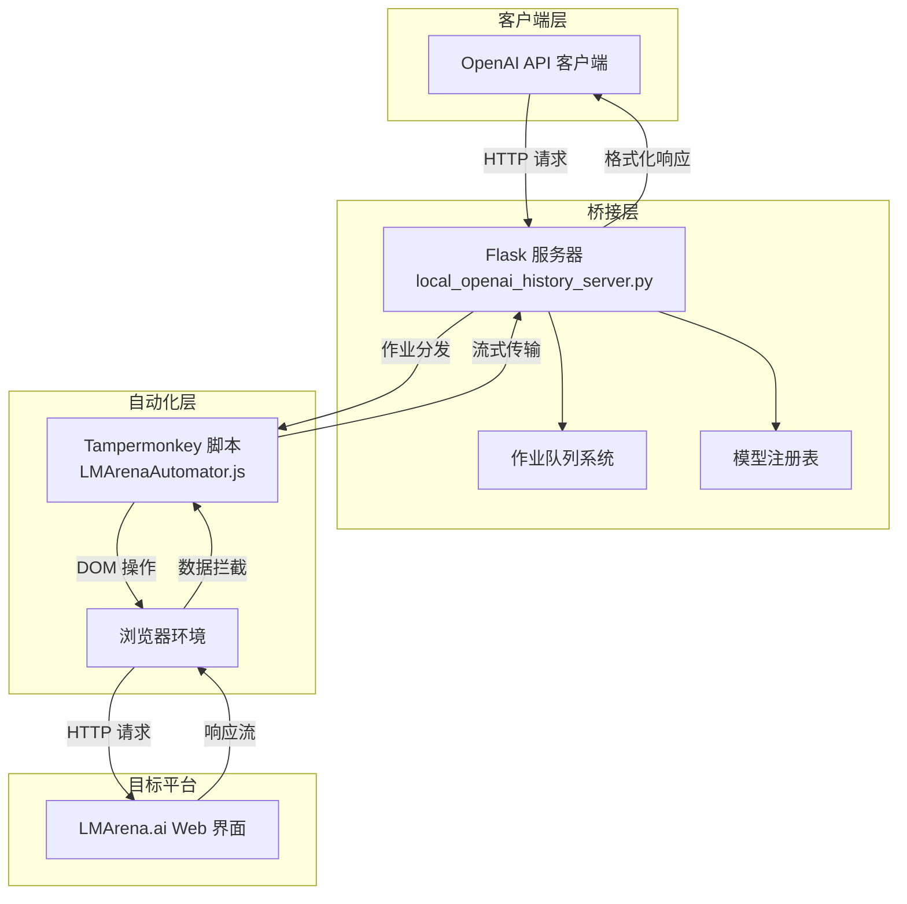

> 介绍一个创新的项目：通过浏览器自动化技术，为没有公开 API 的 LMArena.ai 平台创建 OpenAI 兼容的 API 接口。

<!--more-->

## 项目背景与挑战

LMArena.ai 是一个 AI 模型竞技平台，让用户可以体验和比较各种顶级 AI 模型的表现。然而，它只提供了 Web 界面，没有公开的 API 接口。这意味着开发者无法通过编程方式访问这些模型。

LMArenaBridge 项目巧妙地解决了这个问题：它创建了一个"翻译层"，将标准的 OpenAI API 请求转换为浏览器自动化操作，让任何 OpenAI 兼容的客户端都能无缝使用 LMArena.ai 的模型。

## 系统架构概览

项目采用三层架构设计：



## 核心代码解析

### 1. Flask 服务器：API 兼容层

`local_openai_history_server.py` 是整个系统的枢纽，实现了 OpenAI API 的端点兼容。

#### OpenAI 格式转换

```python
def convert_openai_to_lmarena(openai_request):
    """将 OpenAI 格式转换为 LMArena 内部格式"""
    # 生成必要的 UUID
    session_id = f'c{uuid.uuid4()}'
    user_id = f'u{uuid.uuid4()}'
    evaluation_id = f'e{uuid.uuid4()}'
    
    # 模型名称到 UUID 的映射
    target_model_id = MODEL_NAME_TO_ID_MAP.get(
        openai_request.get('model'), 
        DEFAULT_MODEL_ID
    )
    
    # 消息格式转换
    messages = []
    for msg in openai_request['messages']:
        messages.append({
            'id': str(uuid.uuid4()),
            'evaluationSessionId': session_id,
            'modelId': target_model_id if msg['role'] == 'assistant' else None,
            'role': msg['role'],
            'content': msg['content'],
            'parentMessageIds': [...]  # 维护消息关系
        })
    
    return {
        'id': session_id,
        'userId': user_id,
        'messages': messages,
        'targetModelId': target_model_id
    }
```

关键点：
- UUID 生成确保每个会话的唯一性
- 模型映射通过 `models.json` 文件维护
- 消息关系通过 `parentMessageIds` 构建

#### 作业队列管理

```python
# 全局队列定义
INJECTION_JOBS = Queue()    # 历史注入作业
PROMPT_JOBS = Queue()      # 提示提交作业
TOOL_RESULT_JOBS = Queue() # 工具结果作业
MODEL_FETCH_JOBS = Queue() # 模型获取作业

# 状态管理
RESULTS = {}  # 存储任务结果
INJECTION_EVENTS = {}  # 注入完成事件同步
```

队列系统实现了异步处理，确保浏览器自动化与 API 请求解耦。

### 2. Tampermonkey 脚本：浏览器自动化引擎

`LMArenaAutomator.js` 是技术含量最高的部分，实现了深度的浏览器自动化。

#### Next.js 数据流劫持

```javascript
function performInjection(history_data) {
    // 1. 更新会话 ID
    const urlPath = window.location.pathname;
    const match = urlPath.match(/\/c\/([a-f0-9\-]+)/);
    if (match) {
        history_data.id = match[1]; // 使用当前页面的会话 ID
        history_data.messages.forEach(msg => {
            msg.evaluationSessionId = match[1];
        });
    }
    
    // 2. 劫持 __next_f 数组
    if (self.__next_f) {
        // 处理已存在的数组
        hookPush(self.__next_f);
        
        // 遍历已有数据
        for (let i = 0; i < self.__next_f.length; i++) {
            processChunk(self.__next_f[i]);
        }
    }
    
    // 3. 监听未来数据
    Object.defineProperty(window, '__next_f', {
        set: function(value) {
            hookPush(value);
        }
    });
}

function modifyPayload(payload) {
    // 精确定位 initialState
    const startIndex = payload.lastIndexOf(startMarker, endIndex);
    const endIndex = payload.indexOf(endMarker);
    
    if (startIndex !== -1 && endIndex !== -1) {
        const beforePart = payload.substring(0, startIndex);
        const afterPart = payload.substring(endIndex);
        
        // 注入伪造的历史数据
        const newPayload = beforePart + 
            JSON.stringify(history_data) + 
            afterPart;
        
        return newPayload;
    }
    
    return payload;
}
```

技术亮点：
- 精准的字符串定位算法，避免误替换
- 同时处理现有和未来的数据流
- 保持原有数据结构完整性

#### React 组件操作

```javascript
function typeAndSubmitPrompt(prompt) {
    // 1. 找到带有 React props 的 textarea
    const textarea = document.querySelector('textarea[name="text"]');
    const reactPropsKey = Object.keys(textarea).find(key => 
        key.startsWith('__reactProps$')
    );
    
    if (reactPropsKey) {
        const props = textarea[reactPropsKey];
        
        // 2. 直接调用 React 的 onChange 处理器
        const mockEvent = {
            target: { value: prompt }
        };
        props.onChange(mockEvent);
        
        // 3. 等待 React 状态更新
        setTimeout(() => {
            const submitButton = document.querySelector('button[type="submit"]');
            if (!submitButton.disabled) {
                submitButton.click();
            }
        }, 150);
    }
}
```

精髓之处：
- 不通过 DOM API，而是直接操作 React 内部
- 模拟真实的用户交互事件
- 精确的时序控制

####Fetch 请求拦截

```javascript
function hookFetch() {
    const originalFetch = window.fetch;
    
    window.fetch = async function(...args) {
        const url = args[0];
        
        // 拦截 LMArena 的 API 请求
        if (url.includes('/api/stream/post-to-evaluation/')) {
            const options = args[1] || {};
            const bodyObject = JSON.parse(options.body);
            
            // 1. 替换模型 ID
            const targetModelId = localStorage.getItem(MODEL_ID_STORAGE_KEY);
            if (targetModelId) {
                bodyObject.modelAId = targetModelId;
                
                // 2. 更新最后一条消息的模型 ID
                const messages = bodyObject.messages;
                if (messages.length > 0) {
                    const lastMessage = messages[messages.length - 1];
                    if (lastMessage.role === 'assistant') {
                        lastMessage.modelId = targetModelId;
                    }
                }
            }
            
            // 3. 敏感词绕过逻辑
            if (config.bypass_enabled && messages.length >= 2) {
                const originalUserMsg = messages[messages.length - 2];
                const assistantPlaceholder = messages[messages.length - 1];
                
                if (originalUserMsg.role === 'user' && 
                    assistantPlaceholder.role === 'assistant') {
                    
                    // 插入空消息
                    const emptyUserMessage = {
                        content: ' ',
                        id: crypto.randomUUID(),
                        role: 'user',
                        parentMessageIds: [originalUserMsg.id]
                    };
                    
                    assistantPlaceholder.parentMessageIds = [emptyUserMessage.id];
                    messages.splice(-1, 0, emptyUserMessage);
                }
            }
            
            options.body = JSON.stringify(bodyObject);
        }
        
        // 执行请求并克隆响应用于流处理
        const response = await originalFetch(...args);
        
        if (url.includes('/api/stream/post-to-evaluation/')) {
            const clonedResponse = response.clone();
            
            // 异步处理流
            processStream(clonedResponse);
            
            // 返回原始响应
            return response;
        }
        
        return response;
    };
}
```

关键功能：
- 动态修改请求参数
- 响应克隆实现双流处理
- 敏感词绕过技术

### 3. 响应流式处理

从 LMArena 的原始流式响应提取文本内容：

```python
def _openai_response_generator(task_id):
    """生成 OpenAI 格式的流式响应"""
    text_pattern = re.compile(r'a0:"((?:\\.|[^"\\])*)"')
    
    while True:
        try:
            # 从队列获取原始块
            raw_chunk = RESULTS[task_id]['stream_queue'].get(timeout=1)
            
            # 提取文本内容
            matches = text_pattern.findall(raw_chunk)
            for match in matches:
                # JSON 解码处理转义字符
                text_content = json.loads(f'"{match}"')
                
                if text_content.strip():
                    yield format_openai_chunk(
                        text_content, 
                        model_name, 
                        request_id
                    )
                    
        except Empty:
            # 检查任务状态
            if RESULTS[task_id].get('status') == 'completed':
                break
```

## 技术难点与解决方案

### 1. 会话状态同步

**问题**: 如何让 LMArena 相信对话历史是真实的？

**解决方案**:
- 精确复制 LMArena 的数据结构
- 维护正确的消息关系链
- 使用真实的会话 ID

### 2. 实时性保证

**问题**: 如何实现低延迟的流式响应？

**解决方案**:
- 双队列机制：作业队列 + 流队列
- 事件驱动的异步处理
- 最小化数据处理开销

### 3. 错误恢复

**问题**: 浏览器环境不稳定，如何保证系统可靠性？

**解决方案**:
```javascript
// 轮询错误恢复
async function pollForJob() {
    while (true) {
        try {
            const response = await fetch(`${SERVER_URL}/get_injection_job`);
            const data = await response.json();
            
            if (data.status === 'success') {
                // 处理作业
                processJob(data.job);
            }
        } catch (error) {
            console.error('Error polling for job:', error);
            // 指数退避
            await new Promise(resolve => 
                setTimeout(resolve, Math.min(10000, attempts * 1000))
            );
            attempts++;
        }
        
        await new Promise(resolve => setTimeout(resolve, 3000));
    }
}
```

## 项目的创新之处

1. **架构创新**: 将浏览器作为 API 网关，绕过了传统的 API 限制
2. **技术创新**: 深度整合 Next.js、React 和 Fetch 机制
3. **模式创新**: 提供了一种通用的 Web 服务 API 化方案

## 应用前景

这种架构模式可以应用到许多其他场景：
- 为 SaaS 产品创建 API 接口
- 自动化没有 API 的遗留系统
- 创建多个服务间的统一 API 层

## 总结

LMArenaBridge 展示了前端技术的惊人潜力。通过巧妙地利用浏览器自动化技术，它成功地在 Web 应用和标准 API 之间架起了一座桥梁。这不仅是一个技术创举，更是一种思维方式的突破：当我们面对限制时，创新往往来自于对系统更深层次的理解和利用。

项目的代码质量和架构设计都值得学习，特别是它在异步协调、状态管理和错误处理方面的实现。对于想要深入理解浏览器自动化和系统架构的开发者来说，这是一个绝佳的学习案例。

---

*本文相关代码来源于开源项目 [LMArenaBridge](https://github.com/Lianues/LMArenaBridge)，感谢作者的贡献。*

