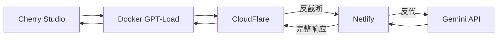

> Gemini API Key 终极管理方案
<!--more-->
----

## 📋 密钥状态

Gemini API Key 管理方案，解决 API 调用限制、断流问题以及多账户负载均衡。

## 🔐 Account Status

### 当前账户配置
- **mako**: `main, online` ✅
- **grey**: `main, online` ✅  
- **fish**: `mylove, hidden` 🔒
- **aibots**: `deprecated, exposed` ❌ (开小号被发现了)

### 账户配额
| 账户     | 配额 | 状态    |
| -------- | ---- | ------- |
| mako     | 10个 | 主用    |
| grey     | 0个  | 被ban了 |
| fish     | 7个  | 主用    |
| 打野付费 | 5个  | 备用    |


### 反代方案

- Netlify mako non fish bot03 rexy bangzhu
- Vercel  non  
  
  [Interface proxy](https://github.com/lovingfish/proxy-interface)
  [palm-netlify-proxy](https://github.com/lovingfish/palm-netlify-proxy)

### 扩展计划
- [ ] 手机 Google Mail 注册新账户增加 Key 数量
- [ ] Chrome 匿名模式管理小号
- [ ] 避免在非匿名环境中操作小号
- [ ] 幽灵代理，没看明白
- [ ] 扩充反截断方案和部署CF Worker数目


## 🏗️ 技术方案

### 核心架构


### 技术栈
- **GPT-Load**: 负载均衡和API管理
- **CloudFlare Worker**: 断流检测和自动续传
- **Netlify** 反代服务
- **Docker**: 容器化部署
- **Google AI API**: 底层服务

### 🔧 详细工作原理

#### 1. 请求流程详解

**第一步：Cherry Studio → GPT-Load**
```text
Cherry Studio 发送请求 → Docker 容器中的 GPT-Load 接收
```

**第二步：GPT-Load → CloudFlare Worker**
```text
GPT-Load 根据负载均衡策略选择 API Key
→ 将请求转发到 CloudFlare Worker
→ Worker 作为中间代理层处理请求
```

**第三步：CloudFlare Worker → Netlify**
```text
CloudFlare Worker 携带选定的 API Key
→ 请求Netlify转发响应
```

**第四步：Netlify → Google API**
```text
Netlify 请求 Google API的相应
```

**第五步：反向传播回 CloudFlare**
```text
→ 实时分析响应内容
→ 检测是否被截断，如果被截断，继续第三步
```
#### 2. 防截断机制 (基于 G.E.M. 方案)

**截断检测算法：**
```javascript
// 伪代码示例
function detectTruncation(response) {
    // 1. 检查响应长度是否异常短
    if (response.length < expectedLength) return true;
    
    // 2. 检查是否以不完整句子结尾
    if (!response.endsWith('.') && !response.endsWith('!') && !response.endsWith('?')) return true;
    
    // 3. 检查是否有截断标记
    if (response.includes('[截断]') || response.includes('...')) return true;
    
    return false;
}
```

**自动续传流程：**
1. **检测截断**: Worker 实时监控响应状态
2. **保存上下文**: 保留原始请求的上下文信息
3. **构造续传请求**: 基于截断点构造新的 API 调用
4. **智能拼接**: 将续传内容与原内容无缝拼接
5. **返回完整响应**: 返回给 GPT-Load 再转发给 Cherry Studio

#### 3. 负载均衡策略

**GPT-Load 配置示例：**
```yaml
# 多账户轮询配置
providers:
  - name: "myself"
    api_key: "${MAKO_API_KEY}"
    quota: 10
  - name: "free" 
    api_key: "${GREY_API_KEY}"
    quota: 7777
  - name: "charge"
    api_key: "${FISH_API_KEY}"
    quota: 5
```

**故障切换机制：**
- 账户配额耗尽时自动切换到下一个可用账户
- 网络异常时重试机制
- 账户被封禁时自动禁用并告警

#### 4. 技术实现要点

**CloudFlare Worker 核心功能：**
- **中间代理**: 作为 GPT-Load 和 Google API 之间的桥梁
- **自适应混淆**: 动态调整请求参数避免检测
- **上下文保持**: 在续传过程中保持对话连贯性
- **错误处理**: 完善的异常处理和重试机制

## 📊 部署进度

### ✅ 已完成
- [x] 三个账户配置完成
- [x] API配额分配
- [x] 基础架构搭建

### 🔄 待完成
- [ ] 手机 Google Mail 注册新账户增加 Key 数量
- [ ] 优化 old 方案，看保留做备用还是直接彻底擦除
- [ ] 其他API如阿里云的配置

## ⚠️ 重要提醒

> **🚨 关键问题：手机端兼容性**
> 
> **忘记了！** 这个方案是完全给 **LapTop 私密化** 的...
> 
> **所以必须保留一些原先的服务器管理 API Key 调用方案给手机 ChatBox 使用**

## 🎯 应用场景分配

### Allocate 策略
<!--这部分慢慢填写，用的api很多-->

| 应用              | 方案   | 说明                                                     |
| ----------------- | ------ | -------------------------------------------------------- |
| **Cherry Studio** | 新方案 | 调用Gemini的话全部这个方案~~ 其他方案可以先设置为 unseen |
| **ChatBox**       | 老方案 | 得用老方案，这个是手机端的                               |
| **RooCode etc**   | 废弃   | 先不动再说，看Cursor和ClaudeCode能否稳定长期使用         |

### 🔍 待考虑的~
想起来什么再补充

- 幽灵反代
- 自建
- [ ] 成本统计和分析
- [ ] 备份和恢复策略

## 📚 Ref

- [GPT-Load](https://www.gpt-load.com/)
- [G.E.M. - 让 Gemini 自动续写被截断的对话【无缝断点续传 | 自适应混淆】](https://linux.do/t/topic/741953)
- [完全解决Gemini 断流问题！！！（有点麻，还是有中断）好像修复了？移步新帖讨论](https://linux.do/t/topic/860161/104)
- [[Gemini公益] 防断流v2|已测试 效果不错](https://linux.do/t/topic/860316)

## 📝 更新日志

- 待补充更多更新记录...
- **2025-08-20** v1，增加稳定反代，扩展反截断
- **2025-08-12**: 初始版本，基础框架搭建


---

*个人技术记录，持续更新中...*


